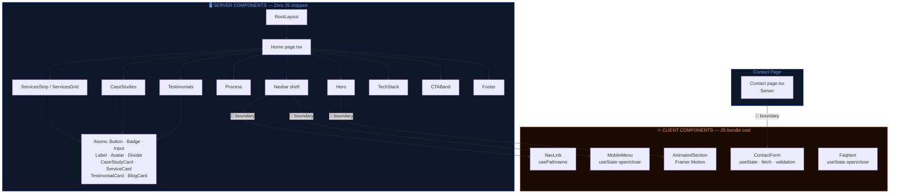
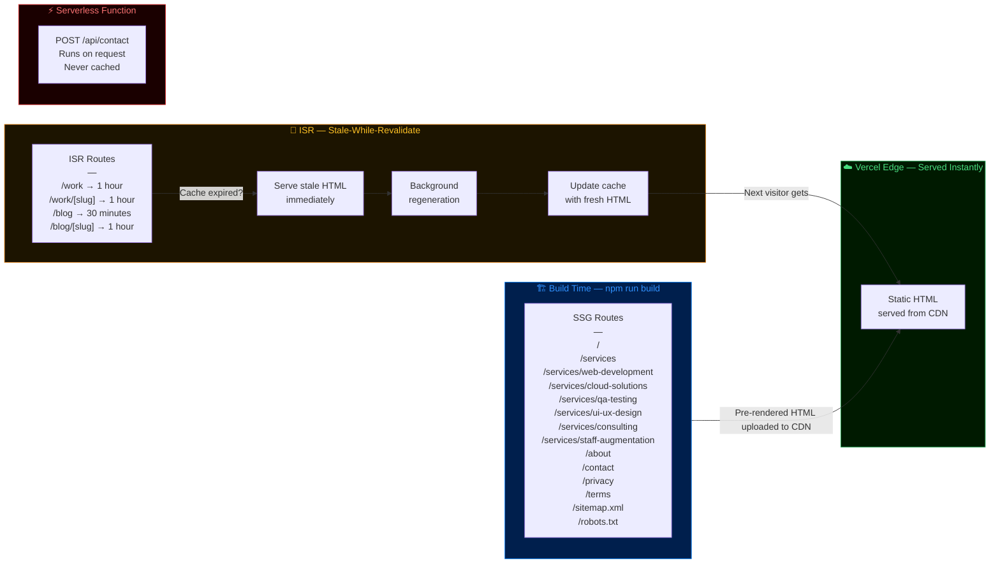
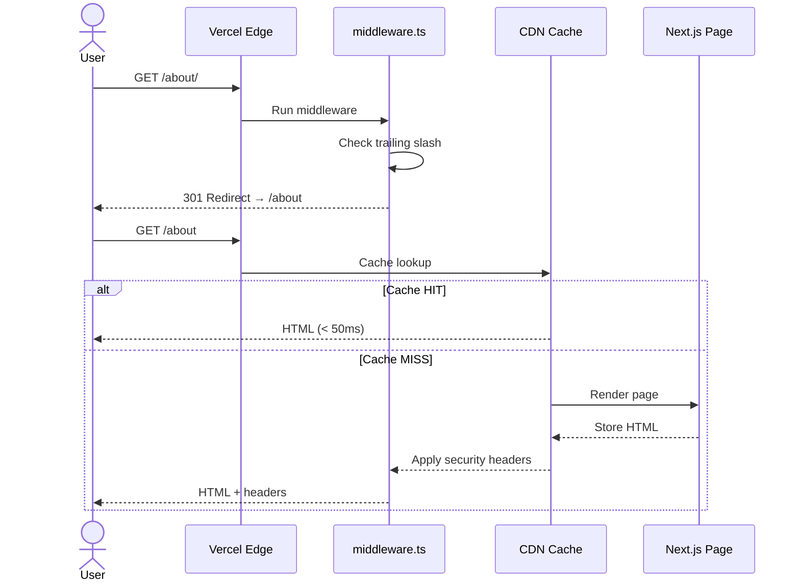

# Step 12 — Technical Architecture
**Project:** SigmaTech Website Revamp
**Date:** 2026-04-25
**Status:** Approved — Pending Client Sign-off

---

## Table of Contents

1. [Architecture Overview](#1-architecture-overview)
2. [Component Architecture — Atomic Design](#2-component-architecture--atomic-design)
3. [Server vs Client Component Strategy](#3-server-vs-client-component-strategy)
4. [Rendering Strategy — SSG & ISR](#4-rendering-strategy--ssg--isr)
5. [Middleware & Edge Layer](#5-middleware--edge-layer)
6. [File System Map](#6-file-system-map)
7. [Architecture Diagrams](#7-architecture-diagrams)
8. [Decision Log](#8-decision-log)

---

## 1. Architecture Overview

SigmaTech's website is a **statically-first, edge-delivered Next.js 14 application**. The architectural goal is maximum performance at zero infrastructure cost — no servers to manage, no cold starts, no per-request compute bills.

### Stack Summary

| Layer | Technology | Decision |
|---|---|---|
| Framework | Next.js 14 (App Router) | SSG/ISR, React Server Components, file-based routing |
| Language | TypeScript (strict) | Type safety at compile time — no runtime type surprises |
| Styling | Tailwind CSS + CSS custom properties | Zero-runtime styling, design token system |
| Animation | Framer Motion (client-only) | Isolated to Client Components — no server bundle cost |
| Email | Resend (Route Handler) | Serverless POST endpoint — no persistent server |
| Hosting | Vercel | Global Edge Network, automatic CDN, preview deployments |
| Analytics | PostHog / Plausible | Script-tag deferred — does not affect Lighthouse |
| Fonts | Google Fonts via `next/font` | Self-hosted at build time — zero external font request |

### Core Architectural Constraints

1. **No server is always on.** All pages are pre-rendered. The only server-side code runs in Vercel's serverless Edge Runtime (middleware) and serverless Functions (API route for the contact form).
2. **JS bundle for the homepage must stay below 150 kB.** Every Client Component added to the homepage increases this. Server Components add zero JS.
3. **No third-party scripts in the critical path.** Analytics, chat widgets, and tracking pixels load after `LCP` via `next/script strategy="afterInteractive"`.
4. **Type-safe from data to render.** Data shapes for services, case studies, and blog posts are defined as TypeScript interfaces. Content files are validated at build time.

---

## 2. Component Architecture — Atomic Design

We adopt a **modified Atomic Design** model adapted for the Next.js App Router. The key modification: atoms and molecules are React Server Components by default. Only the interactive subset becomes Client Components.

```
Atoms       → Single-purpose, no children, no state
Molecules   → Composed of atoms, single responsibility
Organisms   → Complex sections, composed of molecules/atoms
Templates   → Page-level layout shells
Pages       → Next.js App Router `page.tsx` files
```

---

### 2.1 Atoms — `src/components/ui/`

The smallest, indivisible UI primitives. Each atom maps directly to a design token from `theme.ts`. **All atoms are Server Components unless they manage state (e.g., a toggle).**

| Component | File | Props | Notes |
|---|---|---|---|
| `Button` | `Button.tsx` | `variant`, `size`, `asChild`, `children` | Wraps `<button>` or `<a>`. Uses `cn()` + `buttonVariants` from `theme.ts` |
| `Badge` | `Badge.tsx` | `variant`, `children` | Maps to `.badge-*` CSS classes |
| `Input` | `Input.tsx` | `type`, `error`, `...rest` | Forwards all native input props. Applies `.input` + `.input-error` |
| `Textarea` | `Textarea.tsx` | `error`, `...rest` | Same pattern as Input |
| `Label` | `Label.tsx` | `htmlFor`, `children` | Semantic `<label>` with `.label` class |
| `Avatar` | `Avatar.tsx` | `src`, `alt`, `size` | Wraps `next/image` with circular crop |
| `Divider` | `Divider.tsx` | `orientation` | `.divider-h` or `.divider-v` |
| `Icon` | `Icon.tsx` | `icon`, `size`, `aria-hidden` | Thin wrapper over Lucide — enforces size tokens |
| `Skeleton` | `Skeleton.tsx` | `className` | Animated loading placeholder |
| `JsonLd` | `JsonLd.tsx` | `schema` | Injects `<script type="application/ld+json">` |

**Atom interface pattern:**
```typescript
// Example: Button.tsx
interface ButtonProps extends React.ButtonHTMLAttributes<HTMLButtonElement> {
  variant?: ButtonVariant;   // from theme.ts
  size?:    ButtonSize;      // from theme.ts
  asChild?: boolean;         // render as child element (Radix pattern)
}
```

---

### 2.2 Molecules — `src/components/ui/` (complex) + `src/components/sections/` (display)

Molecules combine atoms to perform a specific, focused task. **Server Components unless they contain form state or animation triggers.**

| Component | File | Composed of | Client? |
|---|---|---|---|
| `FormField` | `FormField.tsx` | Label + Input + error message | No (wrapper only) |
| `ServiceCard` | `ServiceCard.tsx` | Icon + Badge + heading + description + link | No |
| `CaseStudyCard` | `CaseStudyCard.tsx` | Image + tag + title + excerpt + metric + link | No |
| `TestimonialCard` | `TestimonialCard.tsx` | Quote + Avatar + citation | No |
| `ProcessStep` | `ProcessStep.tsx` | step number + Icon + title + description | No |
| `TechLogo` | `TechLogo.tsx` | Image + tooltip | No |
| `StatItem` | `StatItem.tsx` | large number + label | No |
| `BlogCard` | `BlogCard.tsx` | Image + date + title + excerpt + author | No |
| `Breadcrumb` | `Breadcrumb.tsx` | list of `{name, href}` + ChevronRight separators | No |
| `NavLink` | `NavLink.tsx` | `<a>` + active state (from `usePathname`) | **Yes** |
| `MobileMenu` | `MobileMenu.tsx` | NavLinks + CTAButton + open/close state | **Yes** |
| `AnimatedSection` | `AnimatedSection.tsx` | Framer Motion wrapper for scroll-in | **Yes** |

---

### 2.3 Organisms — `src/components/layout/` + `src/components/sections/`

Organisms are full-width page sections. They own their own data requirements and are composed of molecules and atoms. **Organisms are Server Components. Interactive sub-parts are isolated Client Component children.**

| Component | File | Location | Client children |
|---|---|---|---|
| `Navbar` | `Navbar.tsx` | `layout/` | `MobileMenu`, `NavLink` |
| `Footer` | `Footer.tsx` | `layout/` | None |
| `PageHero` | `PageHero.tsx` | `sections/` | None |
| `Hero` | `Hero.tsx` | `sections/` | `AnimatedSection` (wraps each element) |
| `ServicesStrip` | `ServicesStrip.tsx` | `sections/` | None |
| `ServicesGrid` | `ServicesGrid.tsx` | `sections/` | None |
| `Process` | `Process.tsx` | `sections/` | None |
| `CaseStudies` | `CaseStudies.tsx` | `sections/` | None |
| `Testimonials` | `Testimonials.tsx` | `sections/` | None |
| `TechStack` | `TechStack.tsx` | `sections/` | None |
| `CTABand` | `CTABand.tsx` | `sections/` | None |
| `ContactForm` | `ContactForm.tsx` | `sections/` | **Entire component** (form state) |
| `FAQ` | `FAQ.tsx` | `sections/` | `AccordionItem` (open/close state) |

**Key pattern — the Server/Client boundary at organisms:**
```
Navbar (Server Component)           ← data fetching, schema, layout
└── logo (static JSX)
└── NavLink × 4 ('use client')     ← usePathname for active state
└── Button (Server Component)       ← static CTA
└── MobileMenu ('use client')       ← useState for open/close
```

---

### 2.4 Component File Conventions

```typescript
// Every component file follows this structure:

// 1. Directive (only if needed)
"use client"; // omit for Server Components

// 2. Imports — external → internal → types
import { motion } from "framer-motion";
import { cn } from "@/lib/utils";
import type { ButtonVariant } from "@/lib/theme";

// 3. Types
interface Props { ... }

// 4. Component (named export — no default for atoms/molecules)
export function Button({ variant = "primary", ...props }: Props) { ... }

// 5. Default export for page-level organisms only
export default function Hero() { ... }
```

---

## 3. Server vs Client Component Strategy

### 3.1 The Decision Rule

```
Ask: "Does this component need to run in the browser?"

YES if it uses:            → 'use client'
  useState / useReducer
  useEffect / useRef
  Browser APIs (window, document, localStorage)
  Event listeners (onClick with state changes)
  Third-party client libraries (Framer Motion, etc.)

NO (Server Component) if:  → No directive needed
  It only renders HTML
  It fetches data (DB, CMS, API — future)
  It reads environment variables
  It uses Node.js APIs
  It's a layout or wrapper
```

### 3.2 Component Boundary Map

```
ROOT LAYOUT                         Server ✓
├── JsonLd (Organization schema)    Server ✓
├── JsonLd (WebSite schema)         Server ✓
├── skip-to-content link            Server ✓
│
├── HOME PAGE                       Server ✓
│   ├── Navbar                      Server ✓
│   │   ├── Logo + links            Server ✓
│   │   ├── NavLink × 4          Client ← usePathname
│   │   └── MobileMenu           Client ← useState (open)
│   │
│   ├── Hero                        Server ✓
│   │   └── AnimatedSection      Client ← Framer Motion
│   │
│   ├── ServicesStrip               Server ✓
│   │   └── ServiceCard × 6         Server ✓
│   │
│   ├── Process                     Server ✓
│   │   └── ProcessStep × 4         Server ✓
│   │
│   ├── CaseStudies                 Server ✓
│   │   └── CaseStudyCard × 3       Server ✓
│   │
│   ├── Testimonials                Server ✓
│   │   └── TestimonialCard × 3     Server ✓
│   │
│   ├── TechStack                   Server ✓
│   │   └── TechLogo × 10           Server ✓
│   │
│   ├── CTABand                     Server ✓
│   │
│   └── Footer                      Server ✓
│
├── CONTACT PAGE                    Server ✓
│   └── ContactForm              Client ← useState, fetch
│
└── BLOG/WORK/SERVICES              Server ✓
    └── (no client state needed)
```

### 3.3 Bundle Impact Analysis

| Scenario | Homepage JS | Impact |
|---|---|---|
| Current (Hero + Navbar as Client) | ~141 kB | Baseline |
| After refactor (only interactive parts as Client) | ~95 kB (est.) | ↓ 33% |
| If Framer Motion removed from Client | ~78 kB (est.) | ↓ 45% |
| Framer Motion tree-shaken correctly | ~95 kB (est.) | Acceptable — target <150 kB |

> **Rule:** Any new Client Component added to the homepage must be benchmarked against the 150 kB first-load JS budget. Use `ANALYZE=true npm run build` (after adding `@next/bundle-analyzer`) to inspect.

### 3.4 Data Fetching Pattern (MVP → Phase 2)

**MVP — Static data files:**
```typescript
// src/data/services.ts
export const services: Service[] = [
  { slug: "web-development", name: "Web & App Development", ... },
  ...
];

// In a Server Component:
import { services } from "@/data/services";
// No async needed — synchronous import
```

**Phase 2 — CMS (Sanity) fetch in Server Component:**
```typescript
// src/app/work/page.tsx  (Server Component)
async function getCaseStudies() {
  const data = await sanityClient.fetch(CASE_STUDIES_QUERY);
  return data;
}

export default async function WorkPage() {
  const caseStudies = await getCaseStudies();
  return <CaseStudyGrid items={caseStudies} />;
}
// revalidate is set in the route segment — see §4
```

---

## 4. Rendering Strategy — SSG & ISR

### 4.1 Route Rendering Decision Matrix

| Route | Strategy | Revalidate | Rationale |
|---|---|---|---|
| `/` | **SSG** | Never (static) | Changes only on deploy |
| `/services` | **SSG** | Never | Changes only on deploy |
| `/services/[slug]` | **SSG** | Never | 6 known slugs, static params |
| `/about` | **SSG** | Never | Changes rarely — redeploy on update |
| `/contact` | **SSG** | Never | No dynamic content |
| `/work` | **ISR** | 3600s (1h) | Case studies added via CMS in Phase 2 |
| `/work/[slug]` | **ISR** | 3600s (1h) | Case study content can be updated |
| `/blog` | **ISR** | 1800s (30m) | New posts published regularly |
| `/blog/[slug]` | **ISR** | 3600s (1h) | Post content updated after publish |
| `/sitemap.xml` | **SSG** | Never | Regenerates on deploy |
| `/robots.txt` | **SSG** | Never | Static |
| `/api/contact` | **Edge Function** | N/A | Serverless POST — not cached |

### 4.2 SSG Implementation

```typescript
// Static page — no revalidate, no async data fetching
// src/app/services/page.tsx
import { PAGE_METADATA } from "@/lib/metadata";

export const metadata = PAGE_METADATA.services;

// generateStaticParams for dynamic static routes
// src/app/services/[slug]/page.tsx
export function generateStaticParams() {
  return [
    { slug: "web-development" },
    { slug: "cloud-solutions" },
    { slug: "qa-testing" },
    { slug: "ui-ux-design" },
    { slug: "consulting" },
    { slug: "staff-augmentation" },
  ];
}
```

**What happens at build time:**
```
npm run build
  → Next.js calls generateStaticParams()
  → Renders each [slug] page as a static HTML file
  → Uploads all HTML to Vercel CDN
  → Served from the nearest edge node to each visitor
  → No compute on request — pure CDN hit
```

### 4.3 ISR Implementation

```typescript
// src/app/blog/page.tsx
export const revalidate = 1800; // 30 minutes

// src/app/blog/[slug]/page.tsx
export const revalidate = 3600; // 1 hour

export async function generateStaticParams() {
  // MVP: returns static slugs from data file
  // Phase 2: fetches published slugs from Sanity CMS
  const slugs = await getBlogSlugs();
  return slugs.map((slug) => ({ slug }));
}

export async function generateMetadata({ params }: { params: { slug: string } }) {
  const post = await getBlogPost(params.slug);
  return createBlogMetadata({ ...post });
}
```

**How ISR works at runtime:**
```
First request after revalidate window expires:
  1. Vercel serves the stale (cached) HTML immediately        ← fast for user
  2. Triggers background re-render of the page
  3. On completion, updates the CDN cache
  4. Next visitor gets the fresh HTML

Result: Always fast. Never stale for more than `revalidate` seconds.
```

### 4.4 On-Demand Revalidation (Phase 2)

When Sanity CMS publishes content, it can trigger a webhook to revalidate specific pages immediately:

```typescript
// src/app/api/revalidate/route.ts  (Phase 2)
import { revalidatePath } from "next/cache";
import { NextRequest, NextResponse } from "next/server";

export async function POST(req: NextRequest) {
  const secret = req.nextUrl.searchParams.get("secret");
  if (secret !== process.env.REVALIDATE_SECRET) {
    return NextResponse.json({ error: "Unauthorized" }, { status: 401 });
  }
  const { path } = await req.json();
  revalidatePath(path);
  return NextResponse.json({ revalidated: true, path });
}
```

---

## 5. Middleware & Edge Layer

### 5.1 Middleware Overview

`middleware.ts` runs at the **Vercel Edge Runtime** — before any page is served, on every request. It is a V8 isolate, not Node.js — no file system access, no native modules.

**Middleware responsibilities for SigmaTech:**

| Responsibility | Why here and not in `next.config.mjs` |
|---|---|
| Security response headers | Applied per-request, not just at config time |
| Trailing slash normalisation | Redirect `/about/` → `/about` before the page renders |
| Legacy URL redirects | Can be dynamic / conditional |
| Basic bot detection (Phase 2) | Can block bad actors at the edge before hitting any origin |

### 5.2 Security Headers

Applied on every response via middleware:

| Header | Value | Purpose |
|---|---|---|
| `X-Frame-Options` | `DENY` | Prevents clickjacking — page cannot be embedded in an iframe |
| `X-Content-Type-Options` | `nosniff` | Prevents MIME type sniffing attacks |
| `Referrer-Policy` | `strict-origin-when-cross-origin` | Leaks minimal referrer info to third parties |
| `Permissions-Policy` | `camera=(), microphone=(), geolocation=()` | Disables browser APIs SigmaTech doesn't use |
| `X-DNS-Prefetch-Control` | `on` | Allows DNS prefetch for performance |
| `Strict-Transport-Security` | `max-age=63072000; includeSubDomains; preload` | HSTS — forces HTTPS for 2 years |
| `Content-Security-Policy` | See below | Restricts what resources the page can load |

**CSP Policy (balanced for functionality + security):**
```
default-src 'self';
script-src 'self' 'unsafe-inline' https://eu.i.posthog.com;
style-src 'self' 'unsafe-inline';
img-src 'self' data: blob: https:;
font-src 'self';
connect-src 'self' https://api.resend.com https://eu.i.posthog.com;
frame-ancestors 'none';
base-uri 'self';
form-action 'self';
```

> `'unsafe-inline'` for scripts is required for Next.js inline scripts (hydration). It can be tightened with nonce-based CSP in Phase 2.

### 5.3 Redirect Strategy

**Static redirects in `next.config.mjs`** (faster — resolved at build time):
```javascript
// For known, stable redirects
async redirects() {
  return [
    { source: "/home",      destination: "/",         permanent: true },
    { source: "/services.html", destination: "/services", permanent: true },
    { source: "/contact-us",   destination: "/contact",  permanent: true },
  ];
}
```

**Dynamic redirects in `middleware.ts`** (for pattern-based or conditional logic):
```typescript
// Trailing slash normalisation
if (pathname !== "/" && pathname.endsWith("/")) {
  return NextResponse.redirect(
    new URL(pathname.slice(0, -1), request.url), 301
  );
}
```

### 5.4 Geolocation Handling

Vercel's Edge Middleware has access to `request.geo` — country, city, latitude, longitude — from Vercel's edge infrastructure. For MVP, this is **unused**. Planned for Phase 2:

```typescript
// Phase 2 — geo-based content personalisation
const country = request.geo?.country ?? "GB";

// Show region-specific CTA copy or pricing
// e.g., "Get a quote in USD" vs "Get a quote in GBP"
const headers = new Headers(request.headers);
headers.set("x-visitor-country", country);
```

### 5.5 Contact Form API Route

The contact form submits to a Next.js Route Handler — the only server-side compute in the MVP:

```
POST /api/contact
  ├── Input validation (Zod schema)
  ├── Rate limiting (IP-based, in-memory for MVP)
  ├── Resend API call (send email to hello@sigmatech.dev)
  ├── Resend API call (send confirmation to submitter)
  └── Return { success: true } or { error: string }

Runtime: Vercel Serverless Function (Node.js 18)
Max duration: 10 seconds
```

---

## 6. File System Map

```
d:/Aroon/SigmaTech/
│
├── src/
│   ├── app/                              # Next.js App Router
│   │   ├── layout.tsx                    # Root layout — Server Component
│   │   ├── page.tsx                      # Home — SSG
│   │   ├── sitemap.ts                    # /sitemap.xml — auto-generated
│   │   ├── robots.ts                     # /robots.txt — auto-generated
│   │   ├── not-found.tsx                 # Custom 404 — SSG
│   │   │
│   │   ├── services/
│   │   │   ├── page.tsx                  # /services — SSG
│   │   │   └── [slug]/
│   │   │       └── page.tsx              # /services/[slug] — SSG
│   │   │
│   │   ├── work/
│   │   │   ├── page.tsx                  # /work — ISR 1h
│   │   │   └── [slug]/
│   │   │       └── page.tsx              # /work/[slug] — ISR 1h
│   │   │
│   │   ├── about/
│   │   │   └── page.tsx                  # /about — SSG
│   │   │
│   │   ├── blog/
│   │   │   ├── page.tsx                  # /blog — ISR 30m
│   │   │   └── [slug]/
│   │   │       └── page.tsx              # /blog/[slug] — ISR 1h
│   │   │
│   │   ├── contact/
│   │   │   └── page.tsx                  # /contact — SSG
│   │   │
│   │   ├── privacy/
│   │   │   └── page.tsx                  # /privacy — SSG
│   │   │
│   │   ├── terms/
│   │   │   └── page.tsx                  # /terms — SSG
│   │   │
│   │   ├── api/
│   │   │   └── contact/
│   │   │       └── route.ts              # POST /api/contact — Edge Function
│   │   │
│   │   └── globals.css                   # Design tokens + component utilities
│   │
│   ├── components/
│   │   │
│   │   ├── ui/                           # ATOMS + simple molecules
│   │   │   ├── Button.tsx                # Server — variant/size props
│   │   │   ├── Badge.tsx                 # Server
│   │   │   ├── Input.tsx                 # Server (controlled by parent form)
│   │   │   ├── Textarea.tsx              # Server
│   │   │   ├── Label.tsx                 # Server
│   │   │   ├── Avatar.tsx                # Server
│   │   │   ├── Divider.tsx               # Server
│   │   │   ├── Skeleton.tsx              # Server
│   │   │   ├── JsonLd.tsx                # Server
│   │   │   ├── FormField.tsx             # Server (wraps Label + Input)
│   │   │   ├── ServiceCard.tsx           # Server
│   │   │   ├── CaseStudyCard.tsx         # Server
│   │   │   ├── TestimonialCard.tsx       # Server
│   │   │   ├── BlogCard.tsx              # Server
│   │   │   ├── ProcessStep.tsx           # Server
│   │   │   ├── TechLogo.tsx              # Server
│   │   │   ├── StatItem.tsx              # Server
│   │   │   ├── Breadcrumb.tsx            # Server
│   │   │   └── AnimatedSection.tsx       # Client ← Framer Motion
│   │   │
│   │   ├── layout/                       # LAYOUT ORGANISMS
│   │   │   ├── Navbar.tsx                # Server shell
│   │   │   ├── NavLink.tsx               # Client ← usePathname
│   │   │   ├── MobileMenu.tsx            # Client ← useState
│   │   │   └── Footer.tsx                # Server
│   │   │
│   │   └── sections/                     # PAGE ORGANISMS
│   │       ├── Hero.tsx                  # Server (AnimatedSection inside)
│   │       ├── ServicesStrip.tsx         # Server
│   │       ├── ServicesGrid.tsx          # Server
│   │       ├── Process.tsx               # Server
│   │       ├── CaseStudies.tsx           # Server
│   │       ├── Testimonials.tsx          # Server
│   │       ├── TechStack.tsx             # Server
│   │       ├── CTABand.tsx               # Server
│   │       ├── PageHero.tsx              # Server (reusable inner page hero)
│   │       ├── FAQ.tsx                   # Server shell
│   │       ├── FaqItem.tsx               # Client ← open/close state
│   │       └── ContactForm.tsx           # Client ← entire form
│   │
│   ├── lib/
│   │   ├── utils.ts                      # cn() helper
│   │   ├── theme.ts                      # Design tokens + TypeScript types
│   │   ├── metadata.ts                   # createMetadata() + PAGE_METADATA
│   │   ├── schema.ts                     # JSON-LD generators
│   │   └── validations.ts                # Zod schemas (contact form, etc.)
│   │
│   ├── data/                             # Static content — replaced by CMS in Phase 2
│   │   ├── services.ts                   # Service definitions + FAQs
│   │   ├── caseStudies.ts                # Case study data
│   │   ├── blog.ts                       # Blog post metadata
│   │   └── team.ts                       # Team member data
│   │
│   └── styles/
│       └── (additional CSS if needed beyond globals.css)
│
├── public/
│   ├── og/
│   │   └── default.png                   # Default OG image (1200×630)
│   ├── icons/                            # Tech stack logos (SVG)
│   ├── images/                           # Team photos, case study covers
│   └── fonts/                            # (empty — next/font self-hosts)
│
├── docs/
│   ├── planning/
│   │   ├── content_strategy.md
│   │   ├── SEO_Checklist.md
│   │   └── technical_architecture.md     ← this file
│   └── 01..11-*.md
│
├── middleware.ts                          # Edge middleware — security headers + redirects
├── next.config.mjs                       # Static redirects + image config
├── tailwind.config.ts                    # Design tokens
├── tsconfig.json
├── postcss.config.mjs
└── package.json
```

---

## 7. Architecture Diagrams

### Diagram 1 — System Architecture (Request → Response)

```mermaid
flowchart TD
    USER([👤 User Browser]) -->|HTTPS Request| VER

    subgraph VER["☁️ Vercel Edge Network"]
        CDN[CDN Cache\nGlobal PoPs]
        MW[Edge Middleware\nmiddleware.ts]
    end

    CDN -->|Cache HIT — serves HTML| USER
    CDN -->|Cache MISS| MW

    MW -->|Security Headers\n+ Redirect Rules| APP

    subgraph APP["⚡ Next.js 14 App Router"]
        direction TB
        LAYOUT[RootLayout\nServer Component\nOrg + WebSite Schema]

        subgraph STATIC["🗂 SSG Pages — Pre-rendered at Build"]
            HOME[/ Home]
            SVC[/services]
            SVC_S[/services/slug]
            ABOUT[/about]
            CONTACT[/contact]
        end

        subgraph REVAL["🔄 ISR Pages — Revalidated on Interval"]
            WORK[/work — 1h]
            WORK_S[/work/slug — 1h]
            BLOG[/blog — 30m]
            BLOG_S[/blog/slug — 1h]
        end

        subgraph API["🔌 Route Handlers"]
            CONT_API[POST /api/contact\nServerless Function]
        end
    end

    APP -->|Static HTML| CDN

    subgraph DATA["📦 Data Layer"]
        STATIC_DATA[src/data/*.ts\nStatic TypeScript files\nMVP]
        CMS[Sanity CMS\nPhase 2]
    end

    STATIC_DATA -->|Import at build time| STATIC
    STATIC_DATA -->|generateStaticParams| REVAL
    CMS -.->|fetch on revalidate| REVAL

    subgraph EXT["🌐 External Services"]
        RESEND[Resend\nEmail API]
        ANALYTICS[PostHog / Plausible\ndeferred script]
        FONTS[Google Fonts\nself-hosted via next/font]
    end

    CONT_API -->|Send email| RESEND
    RESEND -->|Confirmation email| USER
    APP -.->|afterInteractive| ANALYTICS
    FONTS -.->|at build time| APP
```

---

### Diagram 2 — Component Hierarchy & Server/Client Boundary



---

### Diagram 3 — Rendering Strategy by Route



---

### Diagram 4 — Data Flow (MVP → Phase 2 Migration)

```mermaid
flowchart TD
    subgraph MVP["📦 MVP — Static TypeScript Data"]
        TS_DATA["src/data/\nservices.ts\ncaseStudies.ts\nblog.ts\nteam.ts"]
        TS_DATA -->|Synchronous import| SERVER_COMP_MVP[Server Components]
        SERVER_COMP_MVP -->|Rendered HTML| STATIC_HTML[Static HTML]
    end

    subgraph PHASE2["🚀 Phase 2 — CMS Integration"]
        SANITY[Sanity CMS\nContent Studio]
        SANITY_CLIENT["sanityClient.fetch()\n+ GROQ query"]
        SANITY -->|Publish content| WEBHOOK[Webhook]
        WEBHOOK -->|POST /api/revalidate| REVAL_API[On-demand\nRevalidation]
        SANITY_CLIENT -->|Async fetch in\nServer Component| SERVER_COMP_P2[Server Components]
        SERVER_COMP_P2 -->|ISR cached| FRESH_HTML[Fresh HTML]
    end

    subgraph ALWAYS["⚡ Always Serverless — Contact Form"]
        FORM_SUB[ContactForm\nClient Component]
        FORM_SUB -->|POST /api/contact| ROUTE_HANDLER[Route Handler\nNode.js runtime]
        ROUTE_HANDLER -->|Zod validate| ZOD[Input\nValidation]
        ZOD -->|Send| RESEND_API[Resend API]
        RESEND_API -->|Delivers| EMAIL_1[Email to SigmaTech]
        RESEND_API -->|Delivers| EMAIL_2[Confirmation to user]
    end

    style MVP fill:#001F4D,color:#3091FF,stroke:#0A84FF
    style PHASE2 fill:#001a00,color:#4ade80,stroke:#16a34a
    style ALWAYS fill:#1c1400,color:#fbbf24,stroke:#d97706
```



---

### Diagram 5 — Middleware Request Pipeline



---

## 8. Decision Log

| Decision | Chosen | Rejected | Reason |
|---|---|---|---|
| Routing paradigm | App Router | Pages Router | App Router enables React Server Components — essential for our bundle budget |
| State management | React `useState` only | Redux, Zustand, Jotai | Zero global state needed — all state is local to a single component |
| Animation library | Framer Motion | GSAP, CSS animations only | Framer Motion's `useReducedMotion()` hook is a first-class accessibility feature |
| Styling approach | Tailwind + CSS vars | CSS Modules, styled-components | Zero runtime JS, design token system, excellent dark mode support |
| Font loading | `next/font` (self-hosted) | CDN-linked Google Fonts | Eliminates external font request — direct LCP improvement |
| Data source (MVP) | `.ts` static files | JSON files, SQLite | TypeScript type safety at import time, no parsing, no build step |
| Form submission | Route Handler (Node.js) | Serverless function (custom), third-party form service | Keeps everything in-repo, typed, and testable |
| Email provider | Resend | SendGrid, Mailgun, SES | Simplest API, developer-friendly, generous free tier, excellent TypeScript SDK |
| Analytics | PostHog / Plausible | Google Analytics | Privacy-friendly, no cookie banner required in EU, Lighthouse-safe |
| Hosting | Vercel | AWS Amplify, Netlify | Native Next.js support, Edge Middleware, global CDN, zero config |
| CMS (Phase 2) | Sanity | Contentful, Prismic, Strapi | TypeScript-native GROQ queries, real-time preview, generous free tier |

---

*Document owner: Lead Architect / PM*
*Implementation files: middleware.ts, next.config.mjs*
*Next step: Step 13 — Database Design*
